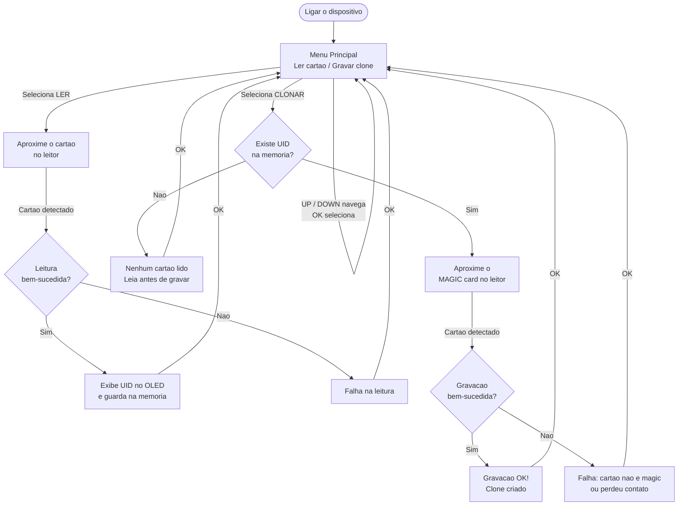
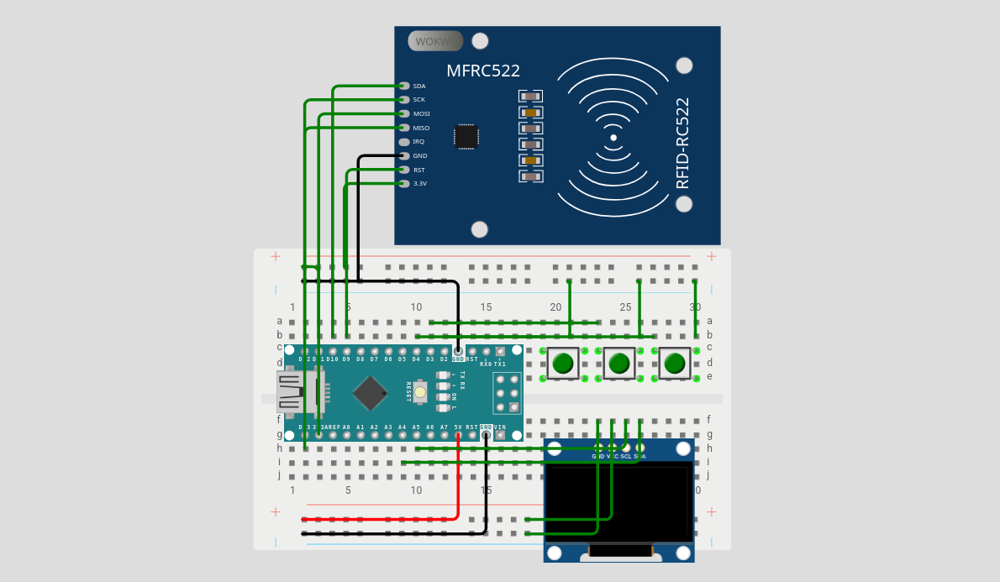

# Clonador de Cartões MIFARE Classic 1K

Projeto desenvolvido para a disciplina de Eletrônica para Computação do curso de Ciências de Computação do ICMC-USP.

---

## 📖 Descrição do Projeto

O Clonador MIFARE é um dispositivo portátil, baseado em Arduino Nano, capaz de ler o UID de um cartão MIFARE Classic 1K e gravá-lo em um "magic card" (cartão com UID regravável). Todo o controle é feito por três botões físicos e um display OLED, sem depender de computador durante a operação.

O objetivo pedagógico é mostrar, de forma tangível, por que a identificação baseada somente no UID de um cartão é insegura: como o UID pode ser copiado para um cartão em branco, qualquer sistema que confie apenas nesse número pode ser enganado por uma cópia.

O sistema possui duas funções principais:

- **LER**: energiza o cartão aproximado, detecta a tag e captura o seu UID (4 bytes), exibindo-o no display e guardando-o na memória.
- **GRAVAR:** grava o UID previamente capturado em um cartão magic de destino (Gen1A ou CUID), efetivamente criando uma cópia.

## 👥 Autores

Projeto desenvolvido para a disciplina de Eletrônica para Computação - ICMC/USP.

| Aluno                     | Nº USP   |
| ------------------------- | -------- |
| Arthur Costa Oliveira     | 17871226 |
| Bruno José Haga Costa     | 16858160 |
| Henrique Nechet Halfeld   | 17896280 |
| Jader Tomson Kalil Sphair | 17869762 |

## 🔁 Diagrama de Funcionamento

## 🧰 Hardware Necessário

| Componente                              | Qtd. | Função no projeto                                                                    |
| --------------------------------------- | :--: | ------------------------------------------------------------------------------------ |
| Arduino Nano (ATmega328P, CH340, USB-C) |  1   | Microcontrolador; executa a lógica de menu, leitura e gravação                       |
| Módulo RC522                            |  1   | Leitor/gravador RFID de 13.56 MHz; comunica via SPI e faz a interface com os cartões |
| Display OLED 0.96" SSD1306 (I2C)        |  1   | Interface visual; exibe o menu, o UID lido e o status das operações                  |
| Botões táteis (2 perninhas)             |  3   | Navegação e confirmação:UP,**DOWN** e **OK**                                         |
| Protoboard 400 furos                    |  1   | Base de montagem sem solda                                                           |
| Jumpers macho-macho                     | ~14  | Ligações internas na protoboard (alimentação, botões, OLED)                          |
| Jumpers macho-fêmea                     |  7   | Ligação do RC522 (montado "voador", fora da protoboard)                              |
| Cabo USB-C                              |  1   | Alimentação e gravação do firmware                                                   |

## 🔌 Esquema de Ligação

O circuito usa **SPI** para o leitor RC522 e **I2C** para o display OLED. Os três botões usam o resistor de _pull-up_ interno do microcontrolador (`INPUT_PULLUP`), dispensando resistores externos.

### Módulo RC522

| Pino no RC522 | Pino no Arduino Nano |
| ------------- | :------------------: |
| SDA / SS      |         D10          |
| SCK           |         D13          |
| MOSI          |         D11          |
| MISO          |         D12          |
| RST           |          D9          |
| 3.3V          |         3.3V         |
| GND           |         GND          |
| IRQ           |          —           |

### Display OLED SSD1306

| Pino no OLED | Pino no Arduino Nano |
| ------------ | :------------------: |
| SDA          |          A4          |
| SCL          |          A5          |
| VCC          |          5V          |
| GND          |         GND          |

### Botões

| Botão | Pino no Arduino Nano |
| ----- | :------------------: |
| UP    |          D2          |
| DOWN  |          D3          |
| OK    |          D4          |

O circuito montado deste projeto:

## 📚 Bibliotecas

Instale as seguintes bibliotecas pelo **Library Manager** da Arduino IDE (`Sketch → Include Library → Manage Libraries...`) para executar o projeto:

| Biblioteca   | Autor        | Função                                                         |
| ------------ | ------------ | -------------------------------------------------------------- |
| MFRC522      | miguelbalboa | Driver do leitor RC522                                         |
| SSD1306Ascii | Bill Greiman | Driver leve do display OLED, escolhida por consumir pouca SRAM |

## 🃏 Sobre os "Magic Cards"

Um cartão MIFARE Classic 1K comum tem o UID gravado de fábrica em um bloco protegido e somente-leitura (o bloco 0 do setor 0). Por isso, não é possível clonar um cartão para uma tag comum, o UID dela não muda.

Os chamados magic cards são cartões especiais em que esse bloco é regravável. Existem duas gerações principais:

- **Gen1A (UID changeable)**: respondem a comandos "de fábrica" (_backdoor_) fora do padrão MIFARE, permitindo reescrever o bloco 0 diretamente.
- **CUID (Gen2):** permitem escrever no bloco 0 usando comandos padrão de escrita MIFARE, comportando-se como um cartão comum, porém com o bloco 0 destravado.

A função GRAVAR deste projeto grava o UID capturado em cartões desses tipos. Ao aproximar um cartão comum na etapa de gravação, a operação falha com a mensagem `Cartao nao e magic`, exatamente o comportamento esperado, que ajuda a demonstrar por que a maioria dos cartões não pode ser copiada.

## 🎥 Demonstração
